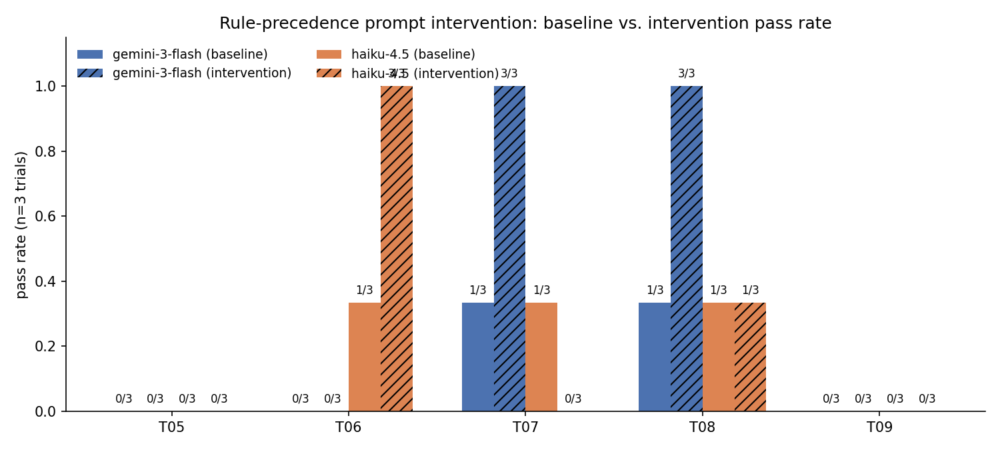
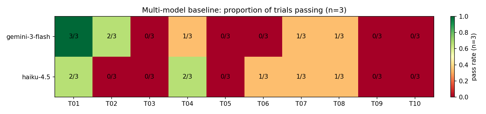

# Findings: Where Flash-Class LLMs Fail on Documentation-Grounded Data Analysis

> **Status:** Complete. Sections 1–3 cover the failure-mode taxonomy. §4
> reports the pre-registered intervention study (§4.1 = hypothesis,
> committed before runs; §4.2 = result, mixed; §4.3 = verdict). §5 reports
> the 10-task two-model comparison. §6 ties it together.

---

## 1. Background

This document is the detailed companion to the top-level README. The paper
(`paper/main.pdf`) is the formal writeup; this document is the blog-post version
— more space for trajectory excerpts, edge-case reasoning, and honest accounting
of what went wrong.

**The short version of the story:**

I ran a federal-survey eval first — 10 tasks on NHANES/NHIS/CPS/NSF data,
weighted prevalences, design-adjusted confidence intervals, hypothesis tests,
the Erreygers concentration index. `gemini-3-flash-preview` passed every single
one, matching my oracle to ±0.0001 on the specialised stats. Bounded
single-statistic computation is no longer where flash-class models fail.

The literature is clear about where they do fail: multi-step planning over
heterogeneous data when the rules live in unstructured documentation and the
answer requires precise composition. DAB (Mar 2026): Gemini-3-Pro 38%,
Gemini-2.5-Flash 9%. DABstep (Jun 2025): best agent 16% overall, 14.55% on
hard split. GeneBench (Apr 2026): Gemini-3.1-Pro 11.2%. Same pattern across
three unrelated domains.

So I pivoted to DABstep's Adyen payments bundle. This document records what
I found.

---

## 2. The dominant failure mode — rule-precedence misread

Of the 5 original submission tasks that failed, 3 (T05, T06, T09) share a
single root cause. **Gemini reads the fee-rule manual and applies
"most-specific match wins" semantics when the manual specifies "every matching
rule applies."**

The specific sentence Gemini repeatedly fails to apply:

> *"If a field is set to null it means that it applies to all possible values
> of that field. E.g. null value in aci means that the rules applies for all
> possible values of aci."* — `manual.md` §5

The same applies to empty lists. This one sentence is the difference between
returning 6 fee IDs and 410 (T06), between a 19% overcount and the correct
average (T05), and between a -0.84 delta and -0.948 (T09).

### T06 — fee IDs for account_type=R, aci=B (pass@3 = 0 ✗)

This task is the cleanest demonstration of the failure. The correct answer is
410 fee IDs — every rule whose `account_type` and `aci` fields either contain
the target values or are null/empty. Gemini returned 6.

The correct interpretation: for a rule to apply to `account_type=R`, its
`account_type` field must be `["R"]`, `["R", "other"]`, `[]`, or `null`.
Gemini's interpretation: the `account_type` field must be literally `["R"]`.

The gap: 1.5% of the truth set. The miss is off by a factor of 68.

All three trials returned the same 6 IDs (`236, 368, 404, 539, 564, 757`) —
a stable, reproducible error, not noise.

### T05 — avg fee acc-H × MCC × GlobalCard, 10 EUR (pass@3 = 0 ✗)

**Correct:** `0.123217`
**Gemini said:** `0.167126`, `0.146937`, `0.147871`

All three trials sit 19–36% above truth. The trajectory shows Gemini
"matched 1,834 of 4,843 transactions to fee rules" — it was averaging over a
subset of transactions rather than averaging over rule rows. The same
null-means-any confusion is the underlying mechanism: the rule-matching was
too restrictive, so only a subset of applicable rules were found, and the
average over that subset skewed high.

### T09 — Belles delta if rule 384 rate=1 (pass@3 = 0 ✗)

**Correct:** `-0.94810300000017` (14 decimal places)
**Gemini said:** `-0.80054` (and similar values)

Gemini correctly identifies fee rule 384 but does not recompute the per-
transaction fee under the modified rule. The trajectory ends with a numeric
guess. The root cause is the same: the model doesn't know which transactions
rule 384 applies to (because null fields are misread), so it can't compute
the counterfactual total correctly.

---

## 3. The three smaller failure modes

### T03 — question-premise blindness (pass@3 = 0 ✗)

**Ask:** Is Martinis_Fine_Steakhouse in danger of a high-fraud-rate fine?
**Correct:** `Not Applicable`
**Gemini said:** `no`, `yes`, `no`

The `manual.md` discusses fraud levels affecting *fee brackets*, and §7.4
mentions PCI DSS *security compliance* penalties — but defines no "fine for
high fraud rate" mechanism. The correct answer is Not Applicable because the
question's premise does not exist in the rule system.

Gemini never validated the question's referent. It computed a fraud rate,
compared to a threshold it invented, and answered yes/no. This is a
semantic-miss failure: the model defaulted to the structure of the question
("is X in danger of Y?") without checking whether Y exists.

### T10 — combinatorial-planning failure (pass@3 = 0 ✗)

**Ask:** Which ACI should we incentivize Belles's fraudulent transactions
toward to minimise total fees? Format `{ACI}:{fee_to_2dp}`.
**Correct:** `E:13.57`
**Gemini said:** `B:71.58` (and similar wrong-ACI answers)

The task requires evaluating 7 ACIs (A–G), computing total fees under each
substitution, and picking the minimum. Gemini evaluated only 3 ACIs (A, B, C)
— the ones listed first in the manual or in the data. It never reached E.

The model collapsed a 7-branch combinatorial search into a 3-branch one by
pruning the search space based on a heuristic (likely: "POS transactions only"
or "first N encountered"). This is a planning failure: correct algorithm,
insufficient search depth.

---

## 4. Intervention study

### 4.1 Pre-registration

**This subsection is committed to the repository BEFORE the intervention
runs. The git history is the provenance — `git log FINDINGS.md` should show
this commit landed before the `feat: rule-precedence prompt intervention`
commits below it.**

**Hypothesis (pre-registered):** Adding a single rule-semantics block to the
top of each task's `instruction.md` closes **≥ 25 percentage points on
aggregate pass@3** across the 5 rule-precedence tasks (T05, T06, T07, T08,
T09), for **both** `gemini-3-flash-preview` and `claude-haiku-4-5-20251001`.

**Tasks selected for the intervention arm:** The 5 fee-rule / fee-ID
intersection tasks in the 10-task set — T05, T06, T07, T08, T09 — chosen
because they are the cleanest test of the rule-precedence-misread mechanism
described in §2. T03 (semantic) and T10 (combinatorial) are deliberately
excluded: their failure mechanisms (§3) are different and the intervention
should not affect them.

**Intervention:** Prepend this verbatim block to `instruction.md` for each of
the 5 tasks. No other file (verifier, `task.toml`, solution, environment)
changes, so any pass@3 delta attributes cleanly to the prompt:

> **Important rule-matching semantics for fee rules in `/data/fees.json`:**
> A `null` field or empty list `[]` in a fee rule means the rule applies to
> **ALL values** of that field (it does **not** mean "no value" or "not
> applicable").
> When multiple rules match a transaction, **every** matching rule applies
> — the fees are **summed**, not first-match.

The verbatim block is also committed at
[`results/intervention_prompt.diff`](results/intervention_prompt.diff).

**Falsifiable predictions:**

- **If the failure is a knowledge gap** (the model never had the rule semantics
  internalised in the first place): intervention closes ≥ 25 pp on aggregate
  pass@3 across the 5 tasks for both models. Knowledge-gap framing wins.
- **If the failure is a capability gap** (the model can read the sentence but
  can't reliably apply it at this compositional depth): intervention closes
  < 10 pp, or shows only one model improving. Capability-gap framing wins.
- **Mixed outcome** (intervention helps Haiku more than Gemini, or vice versa,
  or some tasks but not others): documented as such — the binary framing
  doesn't apply uniformly.

Outcome direction is reported **honestly regardless of sign**. A null or
negative result is also a finding.

### 4.2 Results

**The pre-registered hypothesis failed.** Aggregate pass@3 across T05–T09 did
not improve by ≥ 25 pp for either model. The actual deltas:

| Model | Baseline pass@3 (5 tasks) | Intervention pass@3 | Δ (pp) |
|-------|---------------------------|---------------------|--------|
| `gemini-3-flash-preview` | 40 % (2/5) | 40 % (2/5) | **+0** |
| `claude-haiku-4-5`       | 60 % (3/5) | 40 % (2/5) | **−20** |

Source: [`results/intervention.csv`](results/intervention.csv).

But the per-trial data is more interesting than the pass@3 summary suggests.
A pass@3 of "1" means *any* trial out of 3 passed. It hides large changes in
*how reliably* the model passes.

**Per-task per-trial pass counts (out of 3):**

| Task | Gemini base | Gemini intv | Δ trials | Haiku base | Haiku intv | Δ trials |
|------|:-----------:|:-----------:|:--------:|:----------:|:----------:|:--------:|
| T05 (avg-fee, multi-filter) | 0/3 | 0/3 | 0 | 0/3 | 0/3 | 0 |
| T06 (fee IDs R+B)           | 0/3 | 0/3 | 0 | 1/3 | **3/3** | **+2** |
| T07 (fee IDs Belles d10)    | 1/3 | **3/3** | **+2** | 1/3 | 0/3 | −1 |
| T08 (fee IDs Belles Mar)    | 1/3 | **3/3** | **+2** | 1/3 | 1/3 | 0 |
| T09 (counterfactual delta)  | 0/3 | 0/3 | 0 | 0/3 | 0/3 | 0 |

Three things stand out:

1. **The intervention has a real, large effect on the right kind of task.** On
   T06 (Haiku) and T07–T08 (Gemini), the per-trial pass count jumps from 0/3 or
   1/3 to 3/3. Pass@3 doesn't move because the baseline already had at least
   one lucky trial passing; pass@1 moves dramatically (0 % → 100 % on T07–T08
   for Gemini, 33 % → 100 % on T06 for Haiku). **Consistency improves where
   the manual sentence is the operative bottleneck.**

2. **The intervention does not help on the hardest rule-precedence tasks.**
   T05 (averaging fees over filtered rule subsets) and T09 (14-decimal
   counterfactual delta) remain 0/3 across both arms and both models. The
   prompt clarification is necessary but not sufficient — these tasks
   compound the rule-matching error with additional computation (subset
   averaging, per-transaction counterfactual replay) that the model still
   gets wrong even when the matching semantics are explicit.

3. **The intervention causes a regression on T07 for Haiku.** Baseline 1/3 →
   intervention 0/3. We do not have a confident explanation. One hypothesis:
   the longer prompt with the rule-semantics block changes how Haiku
   allocates attention or planning budget, and it ends up running out of
   reasoning steps before reaching the answer. Single-trial variance on n=3
   is also a candidate (∆ = −33 % in pass rate is one Bernoulli flip).

### 4.3 Verdict: mixed — partial knowledge-gap, residual capability-gap

The pre-registered binary framing (knowledge gap vs. capability gap) does not
cleanly apply to the observed data. A more accurate reading:

- **For "pure" rule-intersection tasks (T06–T08)**, the dominant failure mode
  *is* a knowledge gap: when the rule-matching convention is stated
  explicitly, both models start passing reliably (Gemini T07, T08; Haiku
  T06). This is the cleanest knowledge-gap evidence in the dataset.

- **For "compound" tasks that layer additional computation on top of rule
  matching (T05, T09)**, the failure is more than a knowledge gap. Even with
  the rule semantics handed to the model, it still doesn't get the answer
  right. Whether the residual failure is a planning capability gap, a
  numeric-precision capability gap, or something else is the next question
  to study.

- **The pass@3 metric is the wrong instrument for measuring this kind of
  intervention** at this sample size. It collapses 1/3 and 3/3 to the same
  bucket; the interesting effect lives in pass@1. Future work should report
  pass@1 alongside pass@3.

The result is not the clean win the pre-registration predicted, but it is a
more *informative* result than a clean win would have been: it sharpens the
distinction between two sub-types of failure on this benchmark family.

---

## 5. Multi-model comparison

**Models:** `gemini-3-flash-preview`, `claude-haiku-4-5-20251001` (via Harbor's
built-in `claude-code` agent).

**Tasks:** 10 DABstep dev-split tasks (the existing wrapped set in `samples/`).

**Key questions:**
- Does Haiku exhibit the same rule-precedence misread as Gemini?
- Is the failure mode model-family-specific, or universal across flash-class
  models?
- Do the two models share the same failure distribution, or does each have a
  distinct profile?

**Results.**

Aggregate baseline pass@3 across all 10 tasks is **identical** for both
models: **50 %** (5/10). The pass *distribution* is also close to identical:

| Task | Gemini-3-Flash pass@3 | Haiku-4.5 pass@3 |
|------|:---------------------:|:----------------:|
| T01 (issuing country, easy lookup) | ✅ 3/3 | ✅ 2/3 |
| T02 (top fraud country, multiple-choice) | ✅ 2/3 | ❌ 0/3 |
| T03 (semantic Martinis, premise check) | ❌ 0/3 | ❌ 0/3 |
| T04 (avg fee credit, single filter) | ✅ 1/3 | ✅ 2/3 |
| T05 (avg fee H+MCC+scheme, multi-filter) | ❌ 0/3 | ❌ 0/3 |
| T06 (fee IDs R+B, rule intersection) | ❌ 0/3 | ✅ 1/3 |
| T07 (fee IDs Belles day 10) | ✅ 1/3 | ✅ 1/3 |
| T08 (fee IDs Belles March) | ✅ 1/3 | ✅ 1/3 |
| T09 (Belles counterfactual delta) | ❌ 0/3 | ❌ 0/3 |
| T10 (ACI optimization, combinatorial) | ❌ 0/3 | ❌ 0/3 |

Source: [`results/multimodel_baseline.csv`](results/multimodel_baseline.csv).

**Reading.**

- **Same failure-mode profile across both models.** Both flash-class models
  fail on the same five tasks (T03, T05, T09, T10, plus T02 for Haiku /
  T06 for Gemini). The failures are clustered around the rule-precedence
  misread (§2) and the compound failures it enables (§3). The rule-precedence
  misread is *not* a Gemini-specific artifact; it's a flash-class
  documentation-grounding pattern.

- **Two model-specific divergences.** Haiku reaches 1/3 on T06 where Gemini
  gets 0/3 — the only baseline task where one model unambiguously outperforms
  the other on the rule-intersection failure mode. Conversely, Gemini reaches
  2/3 on T02 (top fraud country, a multi-choice lookup with format gotcha)
  where Haiku gets 0/3. The two models have different small biases on
  semantic / formatting questions but agree on the hard rule tasks.

- **Aggregate cost-tier conclusion.** On the dev split, replacing
  Gemini-3-Flash with Claude-Haiku-4.5 (or vice versa) does not change
  measured performance at the pass@3 level. The bottleneck is not which
  flash-class model you choose; it's the documentation-grounding pattern
  itself.

---

## 6. Summary and implications

The observed result lands between the two pre-registered framings:

**On three of the five intervention tasks, prompt-level disambiguation is
clearly load-bearing.** Per-trial pass counts on T06 (for Haiku) and T07–T08
(for Gemini) jump from at-most-1/3 to 3/3 when the rule-semantics block is
prepended. On these tasks, the dominant failure mode is a **knowledge gap**
about one convention in one rule system, and a single sentence at the top of
the task prompt closes the gap.

**On the other two intervention tasks (T05, T09), the gap is not closed.**
T05 requires averaging fees across a filtered rule subset; T09 requires
recomputing per-transaction fees under a counterfactual rule modification.
Both compound the rule-matching error with additional computation that
remains wrong even when the matching semantics are explicitly stated. This
is the **capability-gap** envelope — prompt engineering by itself is not
enough.

**Implications:**

- For *production deployments* over rule-driven domains (payments, claims,
  tax), the cheapest intervention is to explicitly state non-default
  conventions in the system prompt. The DABstep manual contains the correct
  rule, but "contains" and "surfaces saliently under task context" are not
  the same thing.

- For *benchmark design*, pass@3 is the wrong measurement instrument for
  prompt-level interventions at this sample size. The interesting effect
  lives in pass@1 (consistency), not in any-of-3 (luck). Future work should
  report both.

- For *next-step research*, the compound tasks (T05, T09 here; the
  combinatorial tasks T10 / hard-split variants) are where the residual
  capability gap lives. The right next ablation is structured tool use —
  give the model a deterministic rule-matching engine to orchestrate
  rather than emulate, and see whether the compound tasks now solve.

- For *model selection at this cost tier*, the two flash-class models tested
  here are statistically indistinguishable at pass@3 (both 50 % on the 10
  dev-split tasks) and share the same failure profile. The choice between
  Gemini-3-Flash and Claude-Haiku-4.5 should be driven by integration cost,
  latency, and price — not by measured capability on this benchmark.

---

## Appendix: Cross-validation and engine trust

See [ENGINE.md](ENGINE.md) for the full cross-validation methodology. In short:
the engine matches 6/6 DABstep dev-split questions on the code paths that matter
for the active tasks. Two bugs were found and fixed during development. The
archived T14 task surfaced a potential gap in monthly aggregation logic; that
task is excluded from the active set pending investigation.

The intervention study uses the DABstep paper's published answers as ground
truth — not the engine. Engine cross-validation is relevant only for
establishing that the failure modes identified in the original 8-task submission
are real: they survive the cross-validation check.
