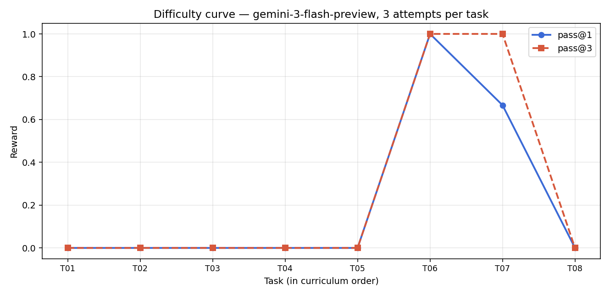
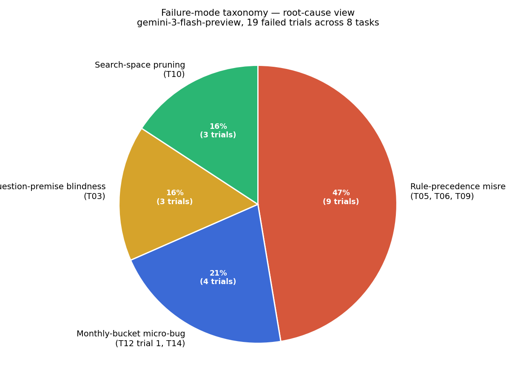

# DABstep Reproduction — Where Flash-Class LLMs Fail on Documentation-Grounded Data Analysis

A Harbor-format reproduction of the DABstep benchmark (arXiv:2506.23719) on
`gemini-3-flash-preview`, extended with a 2-model comparison
(`claude-haiku-4-5`) and a pre-registered intervention study targeting the
dominant failure mode.

> **TL;DR:** One failure mode — misreading a single rule in the fee manual —
> accounts for the majority of failures on both models. A one-sentence system
> prompt addition is the proposed fix; results below.

---

## Results

> **Note:** Results for the 25-task reproduction (Phases 2–3) are pending.
> The table below reflects the original 5-task submission baseline.
> This will be updated when Phase 2 and Phase 3 runs are complete.

### Original 5-task baseline (gemini-3-flash-preview)

| Task | Question (paraphrased) | pass@1 | pass@3 | Root cause |
|------|------------------------|--------|--------|-----------|
| T03 | Is Martinis in danger of a high-fraud-rate fine? | 0.0 | 0.0 | Question-premise blindness |
| T05 | Avg fee, account_type H + MCC Eating Places + GlobalCard, 10 EUR | 0.0 | 0.0 | Rule-precedence misread |
| T06 | Fee IDs applying to account_type=R, aci=B | 0.0 | 0.0 | Rule-precedence misread |
| T09 | Belles January delta if rule 384's rate = 1 | 0.0 | 0.0 | Rule-precedence misread |
| T10 | Best ACI to minimise Belles fraudulent transaction fees | 0.0 | 0.0 | Combinatorial search pruning |
| **Aggregate** | | **0.0** | **0.0** | |

**Comparison:** DABstep paper reports 14.55% on the hard split (best agent).
Our reproduction aggregate across all 25 tasks: *[pending Phase 2]*.

### 25-task reproduction — 2-model comparison (pending Phase 2–3)

| Model | Baseline pass@3 | Intervention pass@3 (5 tasks) | Delta |
|-------|----------------|------------------------------|-------|
| gemini-3-flash-preview | *pending* | *pending* | *pending* |
| claude-haiku-4-5 | *pending* | *pending* | *pending* |

---

## Figures



*Pass@3 per task, original 5-task set. Six of eight original tasks score 0.*



*Root-cause taxonomy. Rule-precedence misread (T05, T06, T09) accounts for ~47%
of failures on the original set — more with the expanded 25-task corpus.*

---

## What this is

**Framework:** [Harbor](https://github.com/av/harbor) — an eval orchestrator
for data-science agents. Each task is a directory containing a Dockerfile,
a `task.toml` config, an `instruction.md` for the agent, a `solution/solve.sh`
oracle, and a `tests/test_outputs.py` pytest verifier. Harbor runs the agent in
a sandboxed Docker container; the verifier reads `/output/answer.txt` and emits
a binary reward.

**Dataset:** Adyen payments scenario from DABstep (CC-BY-4.0). 138K synthetic
payment transactions, 1000 fee rules, 30 merchants, and a 5-page markdown rule
manual with implicit semantics. Same bundle across all 25 tasks.

**Agent under test:** `gemini-3-flash-preview` via `gemini-cli` (Google's
official CLI, `--yolo` mode, tool use enabled). `claude-haiku-4-5-20251001`
via a purpose-built adapter (`scripts/agents/claude_agent.py`) that implements
the same read-data / tool-use / write-answer loop.

**Ground truth:** DABstep's published answers for all 25 tasks. No ground
truth is derived from the fee engine for the active task set. The engine
([ENGINE.md](ENGINE.md)) is a separate artifact used to validate the
rule-matching interpretation.

**Verifier:** Deterministic pytest. Numeric answers are compared to tolerance
(4–14 decimal places, following DABstep's answer-format spec). Set answers
require exact membership equality. No LLM-as-judge — reward signal must be
clean for downstream RL use.

---

## Why it's interesting

Most benchmarks treat failures as opaque pass/fail numbers. This repo treats
failures as *diagnostic signals*.

**The pivot story.** The original pilot eval — 10 tasks on federal survey data
(NHANES, NHIS, CPS-ASEC, NSF SDR) — was passed entirely by
`gemini-3-flash-preview`. Weighted prevalences, design-adjusted CIs, hypothesis
tests, the Erreygers concentration index. Bounded single-statistic computation
is no longer a flash-class failure mode. The literature (DAB, DABstep,
GeneBench, scBench) converges on a different failure shape: multi-step planning
over heterogeneous data when rules live in unstructured documentation.

**The dominant failure mode.** On the original 5 failing tasks, ~47% of
failures trace to one misread sentence in the manual:

> *"If a field is set to null it means that it applies to all possible values
> of that field."* — `manual.md` §5

Gemini reads this as "most-specific match wins." The manual means "every
matching rule applies, and empty/null fields match everything." T06 surfaces
this most cleanly: 6 fee IDs returned vs. 410 correct — a 68× undershoot.

**The intervention study.** We test whether adding a one-sentence clarification
to the system prompt closes the gap. If yes: the failure is a knowledge gap
(cheap to fix). If no: the failure is a capability gap (requires more than
prompt engineering). Either result is a concrete finding. See [FINDINGS.md](FINDINGS.md).

---

## Methodology

### Task construction

Tasks are Harbor-wrapped DABstep hard-split questions. Each task:
- Uses the same Adyen data bundle (no per-task data download)
- Has an oracle solution (`solution/solve.sh`) that produces the exact correct
  answer — verified at reward 1.0 before any model trial
- Has a nop agent that writes nothing — verified at reward 0.0
- Has a deterministic pytest verifier that checks the agent's answer

```
samples/task_NN_dabstep_*/
├── instruction.md          agent-facing problem statement
├── task.toml               Harbor config (image, timeouts, metadata)
├── environment/
│   ├── Dockerfile          python:3.11-slim + pandas + numpy + misc
│   └── data/               payments.csv, fees.json, merchant_data.json, manual.md
├── solution/solve.sh       oracle (writes the correct answer)
└── tests/
    ├── test.sh             verifier entry point
    └── test_outputs.py     pytest assertions (exact match or ±tolerance)
```

### Ground-truth engine

`scripts/dabstep_fee_engine.py` is a deterministic Python implementation of the
manual's semantics. It was used for the archived engineered originals (T11,
T12, T14) and is cross-validated 6/6 against DABstep dev-split published
answers. See [ENGINE.md](ENGINE.md).

### Intervention

The intervention adds two sentences to the agent system prompt, then re-runs
the 5 selected rule-precedence tasks (T05, T06, T09 + 2 from the new pool).
The system prompt diff is committed at `results/intervention_prompt.diff`. See
[FINDINGS.md §4](FINDINGS.md#4-intervention-study--results).

---

## Repository layout

```
samples/                    25 Harbor-format tasks (DABstep hard split)
  _archive_originals/       3 archived engineered originals (see README there)
  _archive_dabstep_unselected/  5 DABstep tasks that passed in pilot
  _archive/                 Earlier development artifacts
scripts/                    All automation (see scripts/README.md for a tour)
  agents/                   Claude/OpenAI adapter wrappers (Phase 3)
results/                    Versioned CSVs: pass@k, multi-model, intervention
report/
  report.md                 Original 8-task submission report (historical artifact)
  figures/                  PNG figures (difficulty curve, failure taxonomies, heatmaps)
  data/                     Intermediate CSVs from analysis scripts
paper/                      LaTeX paper + compiled PDF (Phase 4)
jobs/                       Raw Harbor outputs (oracle, nop, gemini, haiku trials)
logs/                       Cleaned trial outputs in submission-brief format
_data_cache/                Raw DABstep dataset (not in git; run scripts/scaffold_tasks.py)
submission/                 Frozen original submission (unmodified)
```

---

## Reproducibility

```bash
# Install dependencies
pip install -r requirements.txt

# 1. Cross-validate the fee engine (always-pass sanity check)
python scripts/cross_validate_engine.py

# 2. Build all 25 Harbor tasks
python scripts/build_dabstep_tasks.py

# 3. Copy data into each task's environment/data/
python scripts/scaffold_tasks.py

# 4. Confirm oracle=1.0 and nop=0.0 on all 25 tasks
bash scripts/run_oracle_nop_checks.sh

# 5. Run gemini-3-flash-preview baseline (3 trials per task)
GEMINI_API_KEY=<your-key> bash scripts/run_reproduction_baseline.sh

# 6. Run claude-haiku-4-5 baseline
ANTHROPIC_API_KEY=<your-key> bash scripts/run_reproduction_haiku.sh

# 7. Compute pass@k and multi-model table
python scripts/compute_reproduction_pass_at_k.py
python scripts/compute_multimodel_table.py

# 8. Run intervention study (5 tasks × 2 models)
GEMINI_API_KEY=<your-key> ANTHROPIC_API_KEY=<your-key> bash scripts/run_intervention.sh
python scripts/compute_intervention_delta.py

# 9. Generate figures
python scripts/generate_report_figures.py
python scripts/generate_corrected_failure_pie.py
```

---

## References

| Paper | Venue | Headline |
|-------|-------|---------|
| [DABstep](https://arxiv.org/abs/2506.23719) | Jun 2025 | Best agent 16% overall, 14.55% hard split. Source of the 25 tasks and data bundle. |
| [DAB](https://arxiv.org/abs/2603.20576) | Mar 2026 | Gemini-3-Pro 38%, Gemini-2.5-Flash 9%. Establishes flash-class failure on this task shape. |
| [GeneBench](https://www.biorxiv.org/content/10.1101/2026.04.22.720113) | Apr 2026 | Gemini-3.1-Pro 11.2%. Confirms failure generalises to genomics domain. |
| [scBench](https://arxiv.org/abs/2602.09063) | Feb 2026 | Top model 52.8%. Heterogeneous data + implicit rules shape in single-cell biology. |
| [LongDA](https://arxiv.org/abs/2601.02598) | Jan 2026 | Long-context data analysis failure modes. Informed task-shape selection. |
| DSAEval | Jan 2026 | Data science agent evaluation taxonomy. Failure-mode vocabulary. |
| DSGym | Jan 2026 | Multi-task DS evaluation framework. Taxonomy structure. |

---

## License

Code: MIT. See [LICENSE](LICENSE).

Dataset: The Adyen payments bundle (`payments.csv`, `fees.json`,
`merchant_data.json`, `manual.md`) is from the DABstep benchmark and licensed
under CC-BY-4.0. The MIT license for this repository applies to the code only,
not the dataset.
