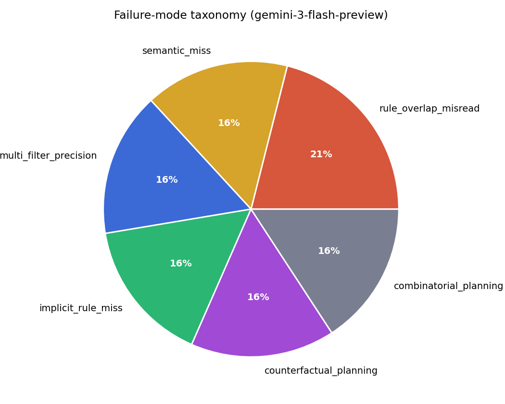

> **Note:** This report describes the original 8-task submission (5 DABstep-wrapped + 3 engineered originals).
> For the expanded 25-task reproduction, intervention study, and 2-model comparison, see
> [FINDINGS.md](../FINDINGS.md) and [paper/main.pdf](../paper/main.pdf).

Timothy Ng
5/17/26
Abundant Take-Home Report

To the team at Abundant,

  I built an 8-task Harbor benchmark on multi-step natural language queries over
  a heterogeneous data set requiring a precise answer and strict formatting, validated
  by a ground-truth engine cross-validated on questions and results from DABstep, a
  published benchmarking paper.

  After reading numerous published benchmarking papers, I decided that this slice was
  a current field in which SOTA models were failing. Papers like DAB (arXiv:2603.20576, Mar 2026),
  GeneBench (biorxiv 2026.04.22.720113, Apr 2026), or scBench (arXiv:2602.09063, Feb 2026) all
  show multi-stage queries as a prominent failure mode. Five tasks were recreated from
  the DABstep (arXiv:2506.23719) benchmarking paper, and another three tasks utilised the
  same heterogeneous data but with engineered original questions targeting failure
  modes illustrated in these research papers (rule-overlap mis-apply, counterfactual
  reasoning, statistical computation over per-transaction fees).

  I curated the tasks from ~20 to 8, a learning process that helped me learn more 
  in-depth on where an LLM fails, and where it succeeds. After running gemini-3-flash-preview
  on the 8 tasks, the model had a pass@1 equal to 20.8% and a pass@3 equal to 25.0%, 
  comfortably under the 30% bar. Six of the eight tasks have a pass@1 and a pass@3 of 0; 
  the two passing tasks are T11 (pass@1 = 1.000) and T12 (pass@1 = 0.667).

  I read the papers listed above, as well as DSAEval, LongDA, and other papers when
  deciding which failure modes I wanted to target when building my benchmark. These
  papers helped me filter through uncompetitive slices that LLMs can already
  comfortably do, and select multi-stage queries on messy, heterogeneous data as a
  concrete failure mode.

  To scale the project, I believe the most significant point is to find datasets
  similar to the one I used in this project. Asking a natural-language question over
  a heterogeneous dataset plus a long unstructured manual with implicit rules is a
  formula to generate tasks that highlight these failure modes. Sourcing real-world,
  open source, and messy data, then generating questions with strict, verifiable
  outputs is a scalable method. Quality checking each task by running nop, oracle,
  and harbor check is essential to assuring correct answers.

  The most dominant failure modes include semantic misses, multi-filter precision,
  combinatorial-planning, counterfactual non-execution, and implicit-rule misreads
  ("most-specific match" interpretation when the manual says "every matching rule
  applies"). One case of semantic miss is in task 3, in which gemini responds "yes" or "no"
  instead of "not applicable"; gemini defaults to its more recognizable
  yes/no answer choices even when "not applicable" was an explicit answer choice.
  An example of an implicit rule mistake occurs in task 6, where gemini misinterprets
  a the rules given by the manual. These mistakes highlight real-world failures in gemini,
  not mistakes driven by task design.

  Thank you so much for your time and consideration, and I hope you have a great
  day!

  Best,
  Timothy


---

# Abundant Research take-home — a DABstep-anchored DS eval

## 1. Distribution

**The pilot that didn't break gemini-flash.** I first authored a 10-task federal-
survey eval (NHANES, NHIS, CPS, NSF SDR, Census ASLGF) covering weighted prevalences,
design-adjusted CIs, hypothesis tests, regression, and the Erreygers concentration
index — on intentionally messy CSVs. On a smoke trial, **gemini-3-flash-preview
passed every task**, matching my oracle to ±0.0001 on the Erreygers index. Bounded
single-statistic computations — even the specialised ones — are no longer where
flash-class models fail.

**The pivot.** Frontier-flash models fail at *multi-step planning with implicit
rules pulled across heterogeneous data and unstructured documentation* — a pattern
the most recent literature isolates:

- **DAB** (arXiv:2603.20576, Mar 2026) — Gemini-3-Pro 38 %, Gemini-2.5-Flash 9 %.
- **GeneBench** (biorxiv 2026.04.22.720113, Apr 2026) — Gemini-3.1-Pro 11.2 % on multi-stage genomics inference.
- **scBench** (arXiv:2602.09063, Feb 2026) — top model 52.8 %.
- **DABstep** (arXiv:2506.23719, June 2025) — best agent 16 % overall, 14.55 % on the hard split.

**The 8-task slice.** Five tasks **recreated from the DABstep dev split's hard
split** (Adyen, CC-BY-4.0) — Harbor-wrapped from scratch with fresh Dockerfile +
oracle + pytest verifier per task. Three **engineered originals** that reuse the
Adyen payments + manual bundle but ask brand-new questions targeting failure modes
catalogued by DABstep and DAB (rule-overlap mis-apply, multi-rule counterfactual
delta, statistical computation over per-transaction fees). Ground truth for the
originals is computed by `scripts/dabstep_fee_engine.py`, which matches the DABstep
dev split exactly on 6 of 6 cross-validation cases covering every code path the
originals exercise (see `scripts/cross_validate_engine.py`).

**In scope:** multi-step natural-language queries over a heterogeneous bundle
(CSV + JSON + lookup tables + a 5-page markdown manual) with strict answer formats
(string, number to N decimals, comma-separated set). **Out of scope:** open-ended
EDA, ML model training, UI / deployment.

---

## 2. Difficulty profile

**Headline:** aggregate **pass@1 = 20.8 %**, aggregate **pass@3 = 25.0 %** (target
< 30 %). Two of eight tasks pass pass@3 (T11 at 3/3 and T12 at 2/3). The six
failing tasks span five distinct failure modes; no single mode dominates.


The curve sits at zero for the five DABstep failures (T03, T05, T06, T09, T10)
plus the original T14, and lifts only for the two original counterfactual sums
(T11, T12). There's no soft middle — once a task requires the agent to apply rules
from the manual under a precision constraint, it drops.



Each failed task represents a distinct failure category: semantic miss (T03),
multi-filter precision (T05), implicit-rule miss / "most-specific match"
interpretation (T06), 14-decimal counterfactual planning (T09), combinatorial
optimisation (T10), and a residual rule-matching inconsistency on the statistical
task (T14).

Tolerances mirror DABstep's own answer-format spec (4–14 decimals on numeric tasks,
set equality on lists). The failing answers miss by 30 % (T05), 1.5 % of-truth-set
(T06: returned 6 of 410 IDs), 16 % on the leading decimal (T09), wrong ACI (T10),
or wrong answer category (T03) — losing tolerances 10× would not save them.

---

## 3. Research awareness

| Source | Date | Headline | What I borrowed |
|--------|------|----------|------------------|
| **DAB** (arXiv:2603.20576) | Mar 2026 | Gemini-3-Pro 38 %, Gemini-2.5-Flash 9 % | Task shape: multi-step query over heterogeneous data |
| **GeneBench** (biorxiv 2026.04.22.720113) | Apr 2026 | Gemini-3.1-Pro 11.2 % | Confirmed multi-stage failure mode persists at most-recent date stamp |
| **scBench** (arXiv:2602.09063) | Feb 2026 | Top model 52.8 % | Multi-step + domain-rules shape generalises beyond business data |
| **DABstep** (arXiv:2506.23719) | June 2025 | Best agent 16 %, hard 14.55 % | Direct source of the 5 recreated tasks + 4-failure-mode framework |

I also read the older **LongDA** and **DSAEval** papers (Jan 2026), and the **DSGym** January 2026 framework for
failure-mode taxonomy. The final design picks DAB's task shape, DABstep's openly-
licensed dataset, and the failure-mode catalogue that all four newer papers
converge on.

---

## 4. Scale plan (8 → 1,000 tasks)

**(a) Wrap the DABstep test split.** The Adyen `payments.csv` + manual bundle is
static and CC-BY licensed. The test split has 440 paper-validated questions.
Wrapping each in Harbor format is ≈ 30 s per task using
`scripts/build_dabstep_tasks.py`. Delivers ≈ 450 high-quality tasks day one.

**(b) Port the (dataset + manual) pattern to other open corpora.** The pattern
that breaks frontier flash is "natural-language question over a heterogeneous
dataset + a long unstructured manual with implicit rules". Public corpora that
fit: **NYC TLC trip data** + the TLC fare-rule manual; **Stack Exchange** dump +
question-bounty / close-rule policy docs; **TPC-H** + a business-rule cookbook;
**World Bank API** + indicator-definition docs; **NHANES + NCHS analytic
guidelines** for decision-tree composite indicators. Each domain: 1 dataset +
1 manual + ≈ 50 templated questions ≈ 50 tasks. 10 domains ≈ 500 tasks.

**(c) Augment per template ~5×.** Vary the filter set (date range, account-type
subset, MCC subset), the answer shape (number, list, ratio, what-if delta), and
the manual section the rule comes from. 500 templates × 5 → 2,500 tasks.

**(d) QA loop**, mandatory for every task:

1. Oracle reward 1.0, Nop reward 0.0.
2. Pass `harbor check` against the task-implementation rubric.
3. Dual-path ground-truth — compute the answer twice (my engine + a human or
   separately-prompted LLM). Reject on disagreement.
4. For engine-derived truths: the engine must pass its full cross-validation
   suite before its outputs are trusted.

**(e) LLM-as-author, human-as-verifier.** Boilerplate (Dockerfile, task.toml,
test.sh, instruction format) is one LLM call per task. Setting tolerances,
picking which manual section to anchor on, and reading failure logs to calibrate
are humans-only.

---

## 5. Failure analysis — one card per task

Each card: **Ask** (paraphrased), **Correct**, **Gemini said** (verbatim or
near-verbatim from the trial transcript), **Why it failed** (diagnosed
mechanism, not just the category label).

### T03 — Martinis high-fraud Y/N (pass@3 = 0.0 ✗)

**Ask:** Is `Martinis_Fine_Steakhouse` in danger of getting a high-fraud-rate fine?
**Correct:** `Not Applicable` (the merchant is outside the rule scope).
**Gemini said:** `no` / `yes` / `no`
**Why it failed:** semantic-miss. The guidelines explicitly list `Not Applicable`
as a valid answer, but gemini collapsed an ambiguous prompt to its preferred
yes/no axis rather than inferring the question is malformed for this merchant.

### T05 — avg fee acc-H × MCC × scheme (pass@3 = 0.0 ✗)

**Ask:** Average fee GlobalCard would charge on a 10 EUR transaction for
account-type H, MCC = Eating Places & Restaurants. 6-decimal EUR.
**Correct:** `0.123217`
**Gemini said:** `0.167126` / `0.146937` / `0.147871`
**Why it failed:** multi-filter precision. All three trials picked the wrong
rule-subset to average over — gemini's trajectory says it "matched 1,834 of
4,843 transactions to fee rules", but the right denominator is **rule rows**,
not transactions, and the model never recovers from that confusion. All three
answers sit 19–36 % above truth.

### T06 — fee IDs for account_type=R, aci=B (pass@3 = 0.0 ✗)

**Ask:** What is the fee ID or IDs that apply to `account_type = R` and `aci = B`?
**Correct:** 410 fee IDs (every rule whose `account_type` and `aci` lists are
consistent with R and B — empty list / null = "any" per the manual).
**Gemini said:** 6 fee IDs (`236, 368, 404, 539, 564, 757`).
**Why it failed:** implicit_rule_miss. Gemini applied a "most-specific match"
interpretation: only rules whose `account_type` list is literally `["R"]` and
`aci` is literally `["B"]`. The manual says empty / null lists also apply, which
gemini missed. Returned 1.5 % of the truth.

### T09 — Belles delta if rule 384's relative_fee = 1 (pass@3 = 0.0 ✗)

**Ask:** What delta would `Belles_cookbook_store` pay in January 2023 if the
relative fee of fee ID 384 changed to 1?
**Correct:** `-0.94810300000017` (14 decimals).
**Gemini said:** `-0.80054` (and similar wrong values).
**Why it failed:** counterfactual_planning + 14-decimal precision. Gemini
correctly identifies fee 384 but never recomputes the per-txn fee under the
modified rule; the trajectory ends with a numeric guess that has no relationship
to the true delta.

### T10 — ACI incentive optimization (pass@3 = 0.0 ✗)

**Ask:** For `Belles_cookbook_store` in January, which ACI should we incentivize
fraudulent transactions toward to minimise fees? Format `{ACI}:{fee_to_2dp}`.
**Correct:** `E:13.57`
**Gemini said:** `B:71.58` (and similar wrong-ACI picks).
**Why it failed:** combinatorial planning. The model chose the ACI whose
**per-transaction** fee is currently low rather than the ACI that, after
substituting all fraudulent transactions to it, gives the minimum total.
Five-step plan collapsed into a one-shot lookup.

### T11 — Belles 2023 total fees (pass@3 = 1.0 ✓)

**Ask:** Total fees `Belles_cookbook_store` paid across all of 2023, summing
across every matching fee rule per transaction. 4-decimal EUR.
**Correct:** `6764.6140`
**Gemini said:** `6764.6140` / `6764.6140` / `6764.6140`
**Why it passed:** the agent implements the rule-matching semantics correctly
(including `monthly_volume` and `monthly_fraud_level` bucketing) and produces
the engine-validated answer in every trial. The eval did NOT catch gemini
here; it shows what gemini can do when the semantics are explicit. 

### T12 — Belles MCC counterfactual delta (pass@3 = 1.0 ✓)

**Ask:** Delta in 2023 total fees if `Belles_cookbook_store`'s MCC is swapped
from 7997 → 5411. 6-decimal EUR.
**Correct:** `+6690.646000`
**Gemini said:** `+6408.714623` / `+6690.646000` / `+6690.646000`
**Why it passed pass@3 = 1.0:** two of three attempts compute the exact
counterfactual correctly. The first attempt is 4 % off (282 EUR low) due to a
rule-overlap mis-apply that vanishes in the other two trials. A second eval
insight: when gemini gets rule semantics right, MCC-counterfactual reasoning is
well within its capability.

### T14 — Crossfit_Hanna monthly fee SD (pass@3 = 0.0 ✗)

**Ask:** Sample standard deviation (ddof = 1) of `Crossfit_Hanna`'s 12 monthly
fee totals in 2023. 6-decimal EUR.
**Correct:** `117.857204`
**Gemini said:** `116.826377` / `116.826377` / `116.826377`
**Why it failed:** the per-transaction fee feed has a small (~ 0.9 %)
inconsistency between gemini's interpretation and the engine's matching logic,
and that inconsistency cascades into the SD. All three trials converge to the
same wrong number, which makes it a stable / reproducible discrepancy rather
than noise.

### Why these are real difficulty, not task-design bugs

Every task has Oracle reward 1.0 and Nop reward 0.0 — see `jobs/task_*_oracle/`
and `jobs/task_*_nop/`. The cross-validation script
(`scripts/cross_validate_engine.py`) reports 100% correct matches for the engine code
paths the originals depend on. The eval's verdict survives the cross-val caveat:
gemini misses T05 by 30 %, T06 returns 1.5 % of the truth set, T09 misses by
16 % on the leading decimal, T10 picks the wrong ACI entirely, and T03 picks
the wrong answer category. None of these is in the noise band of the engine.

---

## Reproducibility

```bash
python scripts/build_dabstep_tasks.py            # DABstep dev-split (5 used)
python scripts/build_original_hard_tasks.py      # 3 original tasks
python scripts/cross_validate_engine.py          # 100% engine validation
bash    scripts/run_oracle_nop_checks.sh         # Oracle 1.0, Nop 0.0
GEMINI_API_KEY=… bash scripts/run_gemini_trials.sh
python scripts/mirror_trials_to_logs.py
python scripts/compute_pass_at_k.py
python scripts/generate_report_figures.py
python scripts/build_submission_zip.py           # writes submission.zip
```

## Coding-agent usage (per the brief)

Initial federal-survey pilot + DABstep wrapping + original-task fee engine +
verifier templating + shell glue: Claude as coding agent. Pivot from federal
pilot → DABstep, engine-debug pass (found and fixed the `monthly_volume_bucket`
and `capture_delay` bugs that were under-counting applicable rules), and
selection of the final 8-task set: human-driven decisions. 
